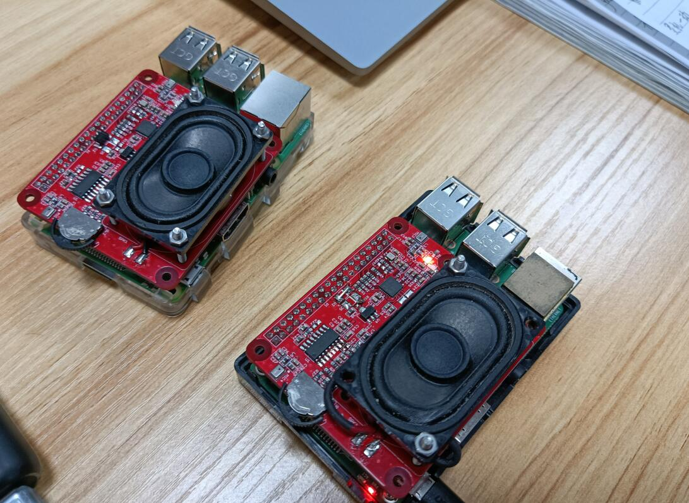

# Raspi Voice Interaction Hat

```c++
/*
Version:		V1.0
Author:			Vincent
Create Date:	2020/11/4
Note:
	
	
*/
```



[toc]

# OVERVIEW

## Introduce

[Makerfabs home page](https://www.makerfabs.com/)

[Makerfabs Wiki](https://makerfabs.com/wiki/index.php?title=Main_Page)

Voice Interaction Hat for Raspberry Pi is an expansion board designed for Raspberry Pi, which provides voice input and audio output, can be used in AI and voice applications.

[wiki link](https://www.makerfabs.com/wiki/index.php?title=Voice_Interaction_Hat)

## Features

- WM8960, the low power, high-quality stereo CODEC.
- 2 analog microphones.
- More than 1 meters radius voice capture
- 3W power speaker.
- Provides 3 additional buttons.
- Support Raspberry Pi Zero, Raspberry Pi 1 B+, Pi 2 B, Pi 3 B, Pi 3 B+.


# Driver

## Use voice card driver from seeed : [seeed-voicecard](https://github.com/respeaker/seeed-voicecard)

*The product is designed with reference to the ReSpeaker 4 Mic Array product of seeed. When using Raspberry Pi to drive this expansion board, you can use the seeed driver to drive it to work.*

This sound card is consistent with [ReSpeaker Mic Hat](https://github.com/respeaker/seeed-voicecard#respeaker-mic-hat).

Get the seeed voice card source code. and install all linux kernel drivers

```
git clone https://github.com/respeaker/seeed-voicecard
cd seeed-voicecard
sudo ./install.sh
sudo reboot
```

Check that the sound card name matches the source code seeed-voicecard.

```
#for ReSpeaker 2-mic
pi@raspberrypi:~/seeed-voicecard $ aplay -l
**** List of PLAYBACK Hardware Devices ****
card 0: ALSA [bcm2835 ALSA], device 0: bcm2835 ALSA [bcm2835 ALSA]
  Subdevices: 8/8
  Subdevice #0: subdevice #0
  Subdevice #1: subdevice #1
  Subdevice #2: subdevice #2
  Subdevice #3: subdevice #3
  Subdevice #4: subdevice #4
  Subdevice #5: subdevice #5
  Subdevice #6: subdevice #6
  Subdevice #7: subdevice #7
card 0: ALSA [bcm2835 ALSA], device 1: bcm2835 ALSA [bcm2835 IEC958/HDMI]
  Subdevices: 1/1
  Subdevice #0: subdevice #0
card 1: seeed2micvoicec [seeed-2mic-voicecard], device 0: bcm2835-i2s-wm8960-hifi wm8960-hifi-0 []
  Subdevices: 1/1
  Subdevice #0: subdevice #0
pi@raspberrypi:~/seeed-voicecard $ arecord -l
**** List of CAPTURE Hardware Devices ****
card 1: seeed2micvoicec [seeed-2mic-voicecard], device 0: bcm2835-i2s-wm8960-hifi wm8960-hifi-0 []
  Subdevices: 1/1
  Subdevice #0: subdevice #0
pi@raspberrypi:~/seeed-voicecard $ 
```


# How To Use

## Record

```bash
arecord  -c 2 -r 16000 -f S16_LE -Dhw:1,0 -d 5 result.wav
```

16 KHZ, 16bit, 2 channel, 5 second recording.

## Play

```bash
aplay -Dhw:1,0 result.wav
```

Play wav format files.

